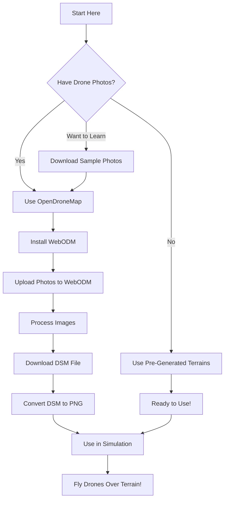
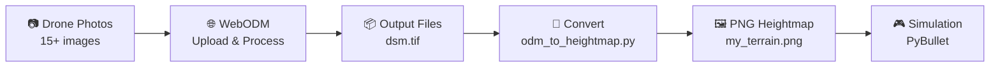
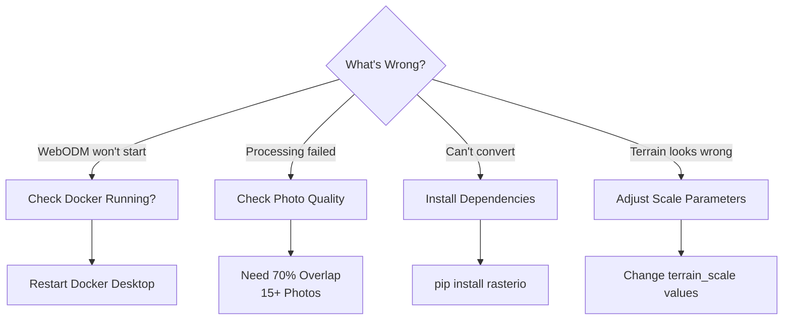

# OpenDroneMap Visual Step-by-Step Guide

## 🎯 Your Goal

Turn aerial drone photos into 3D terrain for your simulation.

---

## 📊 Process Overview



---

## 🚀 Path 1: Easiest (No ODM Needed)

### You Already Have 5 Terrains Ready!

```
✅ terrain_desert_dunes.png    - Smooth dunes
✅ terrain_mountains.png        - Rocky peaks
✅ terrain_canyon.png           - Deep valleys
✅ terrain_hills.png            - Rolling hills
✅ terrain_valleys.png          - Plateaus
```

### Just Edit One Line:

**File:** `swarm-mixed-fleet.py` (line ~516)

```python
terrain_id = create_desert_terrain(
    heightmap_path="assets/terrain_mountains.png",  # ← Pick any terrain!
    texture_path="assets/desert_sand.png",
    terrain_scale=(0.15, 0.15, 5.0)
)
```

### Run:
```bash
python swarm-mixed-fleet.py --gui True
```

**Done! 🎉**

---

## 🎓 Path 2: Learn OpenDroneMap

### Visual Workflow



---

## 📋 Step-by-Step Instructions

### Step 1: Install Docker

#### Windows Users:

1. **Download Docker Desktop**
   - Go to: https://www.docker.com/products/docker-desktop
   - Click "Download for Windows"
   - Run installer (follow prompts)

2. **Restart Computer**
   - Required for Docker to work

3. **Verify Installation**
   ```bash
   docker --version
   ```
   Should show: `Docker version 24.x.x`

---

### Step 2: Install WebODM

Open PowerShell (Windows) or Terminal (Mac/Linux):

```bash
# Download WebODM
git clone https://github.com/OpenDroneMap/WebODM --depth 1
cd WebODM

# Start WebODM (first time takes 10-15 minutes)
# Windows:
./webodm.bat start

# Mac/Linux:
./webodm.sh start
```

**What's Happening:**
- Downloads ~6GB of files (first time only)
- Sets up WebODM server
- Be patient! This takes time.

**When Ready:**
You'll see: `WebODM is running at http://localhost:8000`

---

### Step 3: Get Sample Photos

**Option A: Quick Sample (Recommended)**

1. Visit: https://github.com/OpenDroneMap/odm_data/releases
2. Download: `brighton_beach.zip` (or any dataset)
3. Extract to: `C:\odm_samples\brighton_beach\`
4. Inside you'll find an `images` folder with drone photos

**Option B: Use Your Own Photos**

Requirements:
- ✅ At least 15-20 photos
- ✅ Same location from different angles
- ✅ 70% overlap between photos
- ✅ GPS data embedded (most drones do this automatically)

---

### Step 4: Process in WebODM

#### 4.1: Open WebODM

1. Open browser (Chrome, Firefox, Edge)
2. Go to: **http://localhost:8000**
3. Create account:
   - Username: (your choice)
   - Password: (your choice)
   - Click "Sign Up"

#### 4.2: Create Project

```
1. Click "+ Add Project" (top right)
2. Enter name: "My First Terrain"
3. (Optional) Add description
4. Click "Create Project"
```

#### 4.3: Upload Images

```
1. In your project, click "Select Images"
2. Navigate to your images folder
3. Select ALL photos (Ctrl+A on Windows, Cmd+A on Mac)
4. Click "Open"
5. Wait for upload (shows progress bar)
6. All images should appear in the list
```

#### 4.4: Start Processing

```
1. Click "Start Processing" button
2. A dialog appears - keep default settings for now
3. Click "Start" at bottom
4. Processing begins!
```

**What to Expect:**
- Processing time: 15-60 minutes (depends on image count)
- Progress bar shows status
- Console shows technical details
- Status changes: Queued → Running → Completed

**Don't Close:**
- Keep browser open
- Keep computer on
- Can minimize window

#### 4.5: View Results

When status shows "Completed":

```
1. Click on your project name
2. You'll see:
   - 3D Model viewer
   - Map view
   - Download buttons
```

---

### Step 5: Download Terrain Data

```
1. In your completed project, click "Download Assets"
2. Select "dsm.tif" (Digital Surface Model)
3. Or click "All Assets" to get everything
4. Files download to your Downloads folder
5. Move dsm.tif to a known location, e.g.:
   C:\odm_output\my_project_dsm.tif
```

**File Sizes:**
- dsm.tif: 5-50 MB (depends on area size)
- All assets: 50-500 MB

---

### Step 6: Convert DEM to Heightmap

Open Command Prompt or PowerShell:

```bash
# Navigate to examples folder
cd C:\Users\z7aa\gym-pybullet-drones\gym_pybullet_drones\examples

# Install required libraries (first time only)
pip install rasterio pillow numpy scipy

# Convert DSM to PNG heightmap
python odm_to_heightmap.py --input C:\odm_output\my_project_dsm.tif --output assets\my_terrain.png --size 512 --smooth 2.0
```

**Output:**
```
[DEM] Loading: C:\odm_output\my_project_dsm.tif
[DEM] Dimensions: 4096 x 3072
[DEM] Resizing from (4096, 3072) to (512, 512)...
[DEM] Elevation range: 45.23 to 127.89 m
[SUCCESS] Saved heightmap: assets\my_terrain.png
```

**Files Created:**
- `assets/my_terrain.png` - The heightmap (use this!)
- `assets/my_terrain_metadata.txt` - Info about elevation

---

### Step 7: Use in Simulation

Edit `swarm-mixed-fleet.py` (line ~516):

```python
terrain_id = create_desert_terrain(
    heightmap_path="assets/my_terrain.png",  # ← Your new terrain!
    texture_path="assets/desert_sand.png",
    terrain_scale=(0.15, 0.15, 3.0)  # Adjust if needed
)
```

Run simulation:
```bash
python swarm-mixed-fleet.py --gui True
```

**Success! 🎉 Your custom terrain is now in the simulation!**

---

## 🎛️ Understanding Parameters

### Conversion Parameters

```bash
python odm_to_heightmap.py \
  --input dsm.tif \        # Input DEM file from ODM
  --output terrain.png \   # Output heightmap name
  --size 512 \             # Resolution (256, 512, 1024)
  --smooth 2.0             # Smoothing (0-5)
```

**Size Parameter:**
- `256`: Fast, lower detail, good for testing
- `512`: Balanced, recommended for most uses
- `1024`: High detail, slower, for final results

**Smooth Parameter:**
- `0`: No smoothing (raw data, may be noisy)
- `1-2`: Light smoothing (slight cleanup)
- `3-4`: Medium smoothing (smoother terrain)
- `5+`: Heavy smoothing (very smooth, may lose features)

### Terrain Scale

```python
terrain_scale=(x_scale, y_scale, z_scale)
```

**Example:**
```python
terrain_scale=(0.15, 0.15, 3.0)
#              ^^^^  ^^^^  ^^^
#              |     |     └─ Height multiplier (3 meters tall)
#              |     └─────── Y-axis scale (0.15m per pixel)
#              └───────────── X-axis scale (0.15m per pixel)
```

**Quick Adjustments:**
- Terrain too small? Increase x,y: `(0.3, 0.3, 3.0)`
- Terrain too flat? Increase z: `(0.15, 0.15, 5.0)`
- Terrain too steep? Decrease z: `(0.15, 0.15, 1.5)`

---

## 🔧 Troubleshooting Visual Guide

### Common Issues and Solutions



### Issue 1: WebODM Won't Start

**Symptoms:**
- Can't access http://localhost:8000
- Error messages in terminal

**Solutions:**
1. Check Docker Desktop is running
2. Wait 2-3 minutes after starting
3. Restart Docker:
   ```bash
   cd WebODM
   ./webodm.bat stop
   ./webodm.bat start
   ```

### Issue 2: Processing Fails

**Symptoms:**
- Status shows "Failed" in WebODM
- Error in console logs

**Common Causes:**
- ❌ Too few photos (need 15+)
- ❌ Photos don't overlap enough
- ❌ No GPS data in photos
- ❌ Photos from different locations

**Solutions:**
1. Try with sample data first (to test setup)
2. Check photo EXIF data has GPS
3. Ensure photos overlap 70%+

### Issue 3: Conversion Fails

**Symptoms:**
- `ModuleNotFoundError: No module named 'rasterio'`
- Can't find input file

**Solutions:**
```bash
# Install missing dependencies
pip install rasterio pillow numpy scipy

# Check file path (use full path)
python odm_to_heightmap.py --input "C:\full\path\to\dsm.tif" --output terrain.png
```

### Issue 4: Terrain Looks Wrong in Sim

**Symptoms:**
- Terrain too flat
- Terrain too steep
- Terrain too small
- Terrain stretched

**Solutions:**

**Too Flat:**
```python
# Increase z_scale
terrain_scale=(0.15, 0.15, 8.0)  # Was 3.0, now 8.0
```

**Too Steep:**
```python
# Decrease z_scale OR add smoothing
terrain_scale=(0.15, 0.15, 1.5)  # Reduced from 3.0

# Or re-convert with more smoothing:
python odm_to_heightmap.py --input dsm.tif --output terrain.png --smooth 4.0
```

**Too Small:**
```python
# Increase x,y scales
terrain_scale=(0.5, 0.5, 3.0)  # Bigger terrain
```

---

## 📊 Comparison Chart

### When to Use Each Method

| Method | Best For | Time | Difficulty | Cost |
|--------|----------|------|------------|------|
| **Pre-generated Terrains** | Quick testing, learning simulator | 1 min | ⭐ Easy | Free |
| **Sample Data + ODM** | Learning ODM, testing workflow | 1 hour | ⭐⭐ Medium | Free |
| **Your Own Drone Photos** | Real terrain for research | 2+ hours | ⭐⭐⭐ Advanced | Free (need drone) |

---

## 🎯 Quick Commands Reference

### Start/Stop WebODM
```bash
cd WebODM
./webodm.bat start    # Start server
./webodm.bat stop     # Stop server
./webodm.bat restart  # Restart server
```

### Convert DEM to Heightmap
```bash
# Fast (testing)
python odm_to_heightmap.py -i dsm.tif -o terrain.png --size 256

# Balanced (recommended)
python odm_to_heightmap.py -i dsm.tif -o terrain.png --size 512 --smooth 2.0

# High quality (final)
python odm_to_heightmap.py -i dsm.tif -o terrain.png --size 1024 --smooth 3.0
```

### Generate Example Terrains
```bash
python generate_example_terrain.py
```

---

## 📚 Learning Resources

### Video Tutorials (YouTube)
1. Search: "OpenDroneMap tutorial for beginners"
2. Search: "WebODM getting started"
3. Search: "Drone mapping with ODM"

### Sample Datasets
- **Brighton Beach:** Small, fast to process
- **Seneca:** Medium size, good for learning
- **Toledo:** Larger, more detailed

Download from: https://github.com/OpenDroneMap/odm_data/releases

### Community Help
- Forum: https://community.opendronemap.org/
- Discord: Link available on OpenDroneMap website
- Our docs: See other .md files in this folder

---

## ✅ Success Checklist

### Getting Started
- [ ] Docker installed and running
- [ ] WebODM downloaded
- [ ] WebODM starts successfully
- [ ] Can access http://localhost:8000

### First Project
- [ ] Downloaded sample images
- [ ] Created project in WebODM
- [ ] Uploaded images successfully
- [ ] Processing completed without errors
- [ ] Downloaded dsm.tif file

### Conversion
- [ ] Installed rasterio and dependencies
- [ ] Converted DSM to PNG successfully
- [ ] Heightmap looks correct (grayscale image)
- [ ] Metadata file created

### Simulation
- [ ] Edited swarm-mixed-fleet.py
- [ ] Terrain loads without errors
- [ ] Drones fly over terrain
- [ ] Terrain looks realistic

---

## 🎉 You Did It!

Once you complete this guide, you'll know how to:
- ✅ Install and use OpenDroneMap
- ✅ Process aerial photos
- ✅ Create terrain heightmaps
- ✅ Use custom terrains in simulation

**Next:** Try with your own drone photos for real research terrain!

---

*Questions? Check `ODM_BEGINNERS_GUIDE.md` for more details!*
